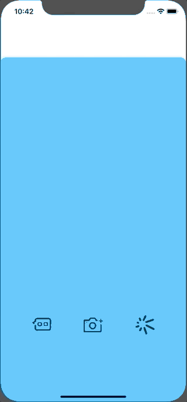

# SnpachatSwipeViewWithScrollView

### Overview

Imitated the navigation design of Snapchat. The thought is that the views (left, middle, right) are all in a UIScrollView which is subview in a childViewController of the rootViewController. But that 'middle view' is unvisible so that when the middle view shows up, the rootViewController can display other view (the red view in my demo, actually camera view in Snapchat).

I used UIPageViewContrller. It is much simpler But it cannot eliminate the side effect of bbbounnnceees.

It is a practice. 

Swift 5 required.

